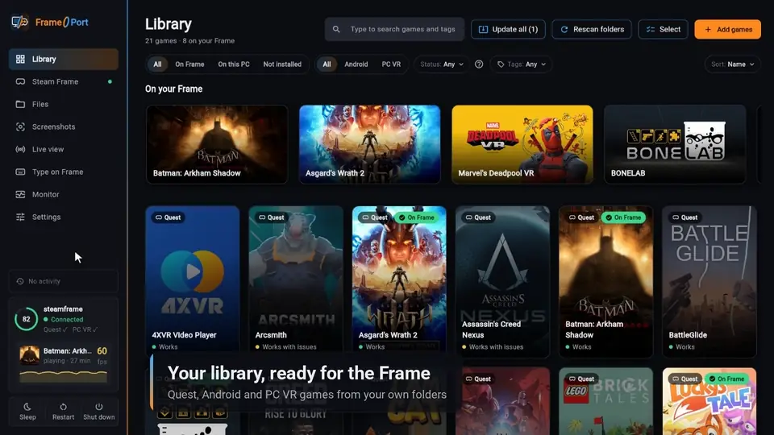

# FramePort

[](https://github.com/spoopyghosty0/frameport/releases/latest)
[](https://github.com/spoopyghosty0/frameport/actions/workflows/build.yml)
[](https://github.com/spoopyghosty0/frameport/releases)
[](LICENSE)


Install Quest games, Android apps, Linux apps and PC VR games on the **Valve Steam Frame**. FramePort sets up the
Frame, patches each game so it runs there, uploads it and adds it to your Steam library with artwork.

[](docs/media/frameport-tour.mp4)

▶ [Watch the full tour](docs/media/frameport-tour.mp4) · New to FramePort? [Watch the install tutorial](docs/media/frameport-install.mp4)
(about 90 seconds each)

> **Notice:** FramePort doesn't download, share or unlock games. Use games you got legally, for example from
> [SideQuest](https://sidequestvr.com/). FramePort downloads published open-source tools (see [Built on](#built-on))
> and adds its own patches so games run on the Frame.
>
> Not every game runs on the Frame: recipes are tested by the community, and some games need Meta's services or
> hardware the Frame lacks.

## Features


- **Easy setup:** one line in the Frame's terminal. No root, no password. [What it changes](docs/FRAME_SETUP.md).
- **One click per game:** patch, upload, add to Steam with artwork and test that it starts.
- **Recipes:** tested patches and settings for 90+ games; other games get suggested patches, each explained in
  plain words.
- **Game settings:** sharpness, refresh rate, controllers, 360° video and mixed reality as simple switches.
- **More than Quest games:** Android apps in a window, Linux apps, PC VR games and Windows programs.
- **Install links:** "Install with FramePort" buttons on websites ([frameport.app](https://frameport.app) links) open
  in FramePort.
- **Your Frame from your PC:** Type on Frame (your keyboard on the Frame), Files, Screenshots, Live view (what the
  headset shows, in your browser) and Monitor (frame rate, temperatures, battery, processes).
- **Updates itself**, and reports problems without personal data.

Details for each: [Install and first steps](docs/INSTALL.md).


## Quick start

1. [Download](https://github.com/spoopyghosty0/frameport/releases/latest) the build for Windows, macOS (Apple
   Silicon) or Linux, unpack it and start FramePort.
2. In FramePort click **Steam Frame → Start setup**. The Frame and your PC must be on the same Wi-Fi (or use a USB
   cable).
3. On the Frame open the **SteamVR dashboard → Launch a program → Desktop**, then the app menu → **System →
   Konsole**, and run:

   ```
   curl -fsSL https://frameport.app/s | bash
   ```

4. Click **Allow** in FramePort when it shows the same 4-digit code as the Frame. Steam restarts once; if it asks to
   install **Lepton** (Valve's Android runtime), confirm it.
5. **Add games → Scan a folder…** with your games, open one and click **Install on Frame**. Play it from the Frame's
   Steam library.

Full guide, firewalls and troubleshooting: [Install and first steps](docs/INSTALL.md). How to lay out game folders:
[FAQ](docs/FAQ.md).

## Compatibility

Tested games use their recipe (the patches and settings that work for them) automatically; for other games FramePort
suggests patches. See the [list of tested games](docs/GAMES.md). Got a game working? Share its recipe from the game's
**…** menu: [how](docs/INSTALL.md#share-a-recipe-or-report-a-problem).

## Compared with other tools

FrameDrop and Valve's own tools install an app as it is. FramePort differs in four ways:

- **Free and open source** (GPL-3.0). FrameDrop is free (donationware) without published source.
- **Quest games that don't run on the Frame as they are** get converted and patched, with a tested recipe for 90+
  games. The others install the game unchanged.
- **Windows, macOS and Linux.** FrameDrop is for Windows.
- **Wi-Fi or a USB cable**, and no **Pair new host** step.

<details>
<summary>All differences</summary>

| | **FramePort** | **FrameDrop** | **By hand with Valve's tools** |
|---|---|---|---|
| Cost and source code | Free, open source (GPL-3.0) | Free (donationware), source not published | Free, from Valve |
| Runs on | Windows, macOS, Linux | Windows | Depends on the tool |
| First connection | One line in the Frame's terminal; it turns on Developer Mode itself. No password | Turn on Developer Mode, then **Pair new host** | Turn on Developer Mode and pair, or use Android's debug tool (adb) |
| Wireless or cable | Wi-Fi, the Frame's hotspot or a USB cable | Same Wi-Fi network | Wi-Fi, or adb |
| Quest games that don't run as they are | Converted and patched for the Frame | Installed as they are | Installed as they are |
| Knows which patches a game needs | Tested recipes for 90+ games, updated without an app update | Not stated | No |
| In the Steam library | Yes, with artwork and tags | As a "Devkit Game" shortcut | As "Devkit Game: &lt;title&gt;"; not with adb |
| Android apps, Linux apps, Windows programs | All three; Proton (runs Windows programs) is installed for you | All three; install Proton first | Yes; 2D Android apps need an extra file |
| PC VR games | On your PC; some also on the Frame | Not supported | Not supported |
| "Install with …" buttons on websites | Yes ([frameport.app](https://frameport.app) links) | Its own | No |
| A game doesn't start | A launch test reads the logs and suggests a patch | A log viewer | No help |
| Use the Frame from your PC | Live view, Monitor, Files, Screenshots, Type on Frame | Not stated | No |

</details>

Other tools as described on their own pages, checked 2026-10-09:
[FrameDrop about](https://framedropvr.com/about) · [how-to](https://framedropvr.com/how-to) ·
[Valve: loading games on Steam Frame](https://partner.steamgames.com/doc/steamhardware/steamframe/loadgames).
Out of date? [Report a problem](https://github.com/spoopyghosty0/frameport/issues/new).

## Built on

Most of the work is done by these projects:
[OVRPort](https://github.com/Android-XR-Bridge/OVRPort) (Quest → OpenXR, originally
[ovrport/app](https://github.com/ovrport/app)) · Valve Lepton, Proton and SteamVR ·
[Revive](https://github.com/LibreVR/Revive) · Mesa (Zink) · [Khronos OpenXR SDK](https://github.com/KhronosGroup/OpenXR-SDK)
· Eclipse Temurin, Android apksigner and NDK · [Flet](https://flet.dev) · OculusDB and Steam store data.
What FramePort adds: [Architecture](docs/ARCHITECTURE.md).

## Documentation

| | |
|---|---|
| [Install and first steps](docs/INSTALL.md) | Install, connect, update, PC VR games, files, problem reports |
| [What the setup changes](docs/FRAME_SETUP.md) | What setup changes on the Frame, networks and firewalls, undoing it |
| [Compatibility](docs/COMPATIBILITY.md) | What runs and how well |
| [Tested games](docs/GAMES.md) | Tested games and how well they run |
| [FAQ](docs/FAQ.md) | Game folders and common questions |
| [Porting playbook](docs/PLAYBOOK.md) | Symptoms and fixes per game |
| [Steam Frame runtime reference](docs/FRAME_RUNTIME.md) | Facts about the Frame's runtime |
| [Architecture](docs/ARCHITECTURE.md) | How the code is organized |
| [Contributing](CONTRIBUTING.md) | Code, recipes, translations |

## Development

```
uv sync --extra dev
uv run frameport-gui        # the app
uv run frameport --help     # command line
uv run pytest               # tests
```

## AI usage

I don't have much free time for this project, so I use AI tools to debug compatibility problems faster.

## License

GPL-3.0-only (includes GPL-3.0 code from OVRPort). Not affiliated with Valve or Meta.
