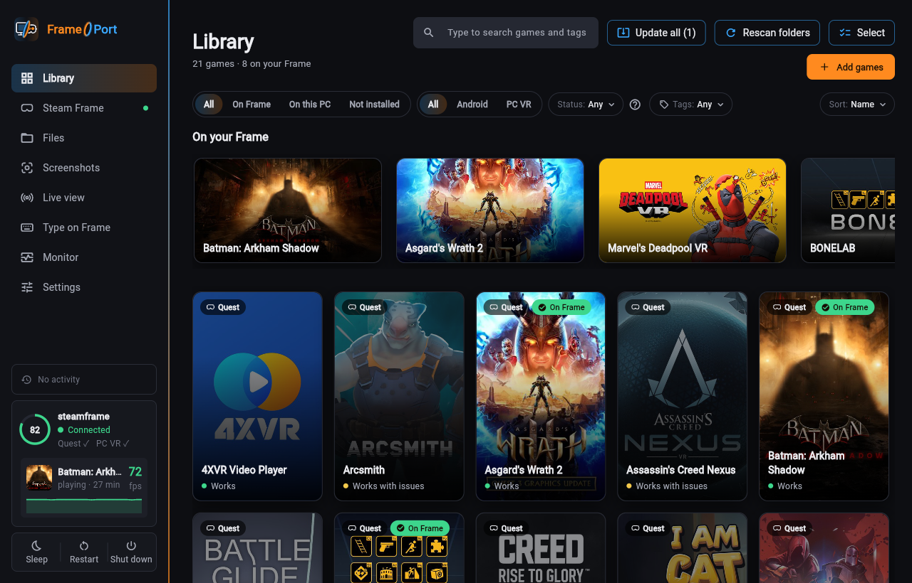
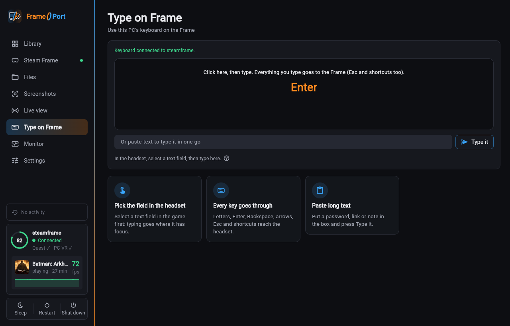
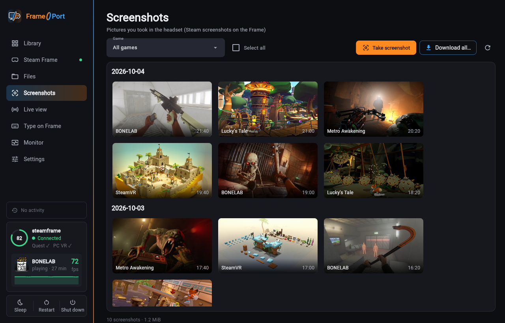
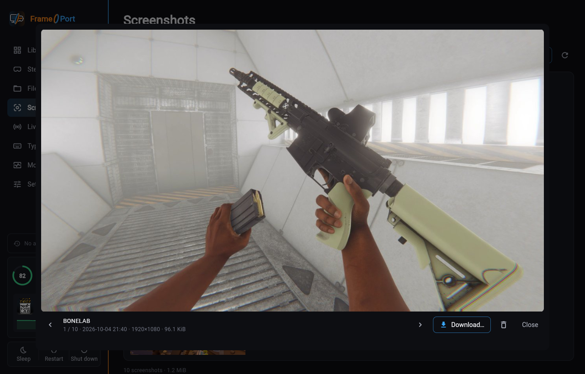
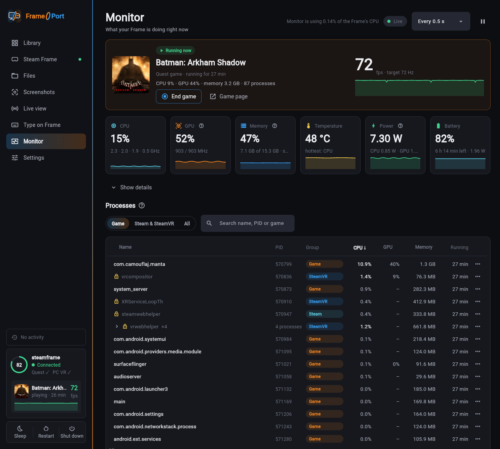

# FramePort

[](https://github.com/spoopyghosty0/frameport/releases/latest)
[](https://github.com/spoopyghosty0/frameport/actions/workflows/build.yml)
[](https://github.com/spoopyghosty0/frameport/releases)
[](LICENSE)


Install games that target the Meta Quest, Android, or general PCVR onto your **Valve Steam Frame**. FramePort handles everything from uploading game files, setting up your Frame, injecting compatibility patches, and adding shortcuts to your Steam library. FramePort aims to be as simple as possible by taking advantage of the fact that the Steam Frame runs on Linux.



> **Notice:** FramePort explicitly does NOT download, share, or unlock games. You must provide legally obtained game
> executables. Core features of FramePort simply download and wrap other published tools (see [Built on](#built-on))
> with patches provided by FramePort adding a hardware compatibility layer. This enables users to use games/apps legally
> purchased on sites like [SideQuest](https://sidequestvr.com/). 

## Features

- **Painless setup:** one short command on the Frame. No root, no `sudo`, no password.
  [What it changes](docs/FRAME_SETUP.md).
- **Type on Frame:** use your computer's keyboard on the Frame: in VR apps, Android apps, Steam and the desktop.
  [More](#type-on-frame).
- **One click per game:** convert, patch, sign, upload, add to Steam with artwork, launch test. Artwork that can't be found automatically can be picked from the stores or replaced with your own images.
- **Per-game recipes:** a tested catalog plus detection rules; every patch explained in plain words.
- **FrameBridge:** FramePort's OpenXR adapter emulates what the Frame natively lacks (passthrough, room, controller models,
  curved and 360° layers); game settings as simple switches.
- **Beyond Quest:** Android apps as windows, PC VR via Proton or Revive, Windows (non-VR) games via Proton, a Files
  tab with drag and drop.
- **Linux apps:** install Linux apps (AppImage, a folder, or a zip/tar archive) on the Frame with a Steam
  shortcut; arm64 builds run natively on SteamOS, x86_64 builds through Valve's FEX translator.
- **Install links:** "Install with FrameDrop" buttons on web pages (the one-click protocol of the FrameDrop
  sideloader) and pasted links open in FramePort, which asks, downloads, adds and installs the build.
- **Screenshots tab:** the screenshots you took in the headset, sorted by game (matched by play time) and day;
  view them and download them to your computer.
- **Live view tab:** watch what the headset shows, with sound, in a browser window on your computer.
- **Monitor tab:** the running game's frame rate, the Frame's load, temperatures, power and battery live, and its
  processes, which you can end. [More](#monitor).
- **Self-updating** releases, redacted diagnostics, one-click problem reports and working-config sharing.

## Quick start

1. [Download](https://github.com/spoopyghosty0/frameport/releases/latest) and unzip the build for Windows, macOS
   (Apple Silicon) or Linux, then start FramePort.
2. **Connect the Frame** (once):
   1. In FramePort click **Steam Frame → Show setup command**. Keep FramePort open; the Frame and your computer must
      be on the same Wi-Fi.
   2. On the Frame open the **SteamVR dashboard → Launch a program → Desktop**: the Linux desktop opens on a virtual
      screen.
   3. Open the app menu (bottom-left corner of that desktop) → **System → Konsole** (or search for Konsole).
   4. Type the command FramePort shows exactly as shown (on-screen keyboard or any USB/Bluetooth keyboard) and press
      **Enter**. This will run the following [bash setup script](bootstrap/bootstrap.sh).
   5. After a few seconds the desktop closes by itself (Steam restarts once); that's expected. If
      Steam asks to install **Lepton**, confirm it. FramePort shows the Frame as connected within a minute. No
      password needed.
3. **Add games → Scan a folder** with your game backups (APK + OBB, or PC VR game folders).
4. Open a game → **Install on Frame**, then play it from the Frame's Steam library.

Full guide, firewalls and troubleshooting: [docs/INSTALL.md](docs/INSTALL.md). Questions (e.g. how to lay out games
with OBB files): [docs/FAQ.md](docs/FAQ.md).

## Type on Frame

Typing in VR is painful, so FramePort turns your computer's keyboard into a keyboard for the Frame. Open **Type on
Frame** (its own tab in the sidebar), select a text field in the headset and type: searches, logins, chat, in any
app, in Steam or on the desktop. Paste longer text to type it in one go. Nothing to install: FramePort adds a virtual
keyboard on the Frame while the tab is open, without root.



Unity apps whose text fields close the moment you select them on the Frame (no system keyboard there) get a per-game
fix, so Steam's on-screen keyboard and Type on Frame work in them too.
[Details](docs/INSTALL.md#typing-on-the-frame).

## Screenshots

Screenshots you take in the headset show up in FramePort's **Screenshots** tab, grouped by day and matched to the game
you were playing. Open one full size, step through them, and download single shots, a selection or all of them to
your computer.





## Live view

The **Live view** tab streams what the headset shows, with its sound, to your computer: click **Start live view** and
it opens in your default web browser (full screen with a double-click; click **Sound on** to hear it, as browsers start
videos muted). Pick 360p to 1080p, or the headset view's full size. The picture comes from SteamVR's built-in headset
view on the Frame and is encoded there while you watch (about one CPU core), so stop it when you're done. It's black
while the headset sleeps.

## Monitor

The **Monitor** tab shows what the Frame is doing while it's open: the running game with its frame rate against the
display's refresh rate, CPU, graphics chip, memory, the hottest temperature with the fan speed, power draw and battery
time left, each with a 2-minute chart. **Show details** adds every CPU core, all temperature sensors, where the power
goes and the network. Below, the game's processes (or Steam's, or all of them) with their CPU, GPU and memory use:
right-click one to end it, or end the whole game. Programs that Steam, SteamVR or the desktop need are marked and ask
again. The Frame sends the numbers itself (about 1 % of one CPU core) and stops when you leave the tab.



## Compatibility

If a game has already been tested with FramePort, it will automatically use the optimal game config. Otherwise, FramePort
will attempt to guess key patches. If you find a new config that works for an app you are testing, please consider submitting it to the community!

**[List of tested games](docs/GAMES.md)**

**Tested something? Share it.** In FramePort open the game → **…** → **Share working recipe…** (it fills in the
recipe for you) or **Report a problem…** (attaches a diagnostics zip with personal data removed). Without the app:
[share a working config](https://github.com/spoopyghosty0/frameport/issues/new?template=working-config.yml) · [report a problem](https://github.com/spoopyghosty0/frameport/issues/new?template=bug-report.yml). Shared configs become built-in recipes for everyone.

## Built on

[OVRPort](https://github.com/Android-XR-Bridge/OVRPort) (Quest → OpenXR, originally
[ovrport/app](https://github.com/ovrport/app)) · Valve Lepton, Proton and SteamVR ·
[Revive](https://github.com/LibreVR/Revive) · Mesa (Zink) · [Khronos OpenXR SDK](https://github.com/KhronosGroup/OpenXR-SDK)
· Eclipse Temurin, Android apksigner and NDK · [Flet](https://flet.dev) · OculusDB and Steam store data.
What FramePort adds itself: [docs/ARCHITECTURE.md](docs/ARCHITECTURE.md).

## Documentation

| | |
|---|---|
| [INSTALL.md](docs/INSTALL.md) | Install, connect, update, PC VR, files, problem reports |
| [FRAME_SETUP.md](docs/FRAME_SETUP.md) | What setup changes on the Frame, networks and firewalls, undoing it |
| [COMPATIBILITY.md](docs/COMPATIBILITY.md) | What runs and how well |
| [GAMES.md](docs/GAMES.md) | Tested games and how well they run |
| [PLAYBOOK.md](docs/PLAYBOOK.md) | Symptoms and fixes per game |
| [FRAME_RUNTIME.md](docs/FRAME_RUNTIME.md) | Steam Frame runtime facts |
| [ARCHITECTURE.md](docs/ARCHITECTURE.md) | How the code is organised |
| [CONTRIBUTING.md](CONTRIBUTING.md) | Code, recipes, translations |

## Development

```
uv sync --extra dev
uv run frameport-gui        # the app
uv run frameport --help     # command line
uv run pytest               # tests
```

## AI Usage Notice
While I would like to program everything manually, I no longer have much free time for personal projects. As a result I make use of AI tools to make it significantly quicker to debug compatibility issues.

## License

GPL-3.0-only (includes GPL-3.0 code from OVRPort). Not affiliated with Valve or Meta.
