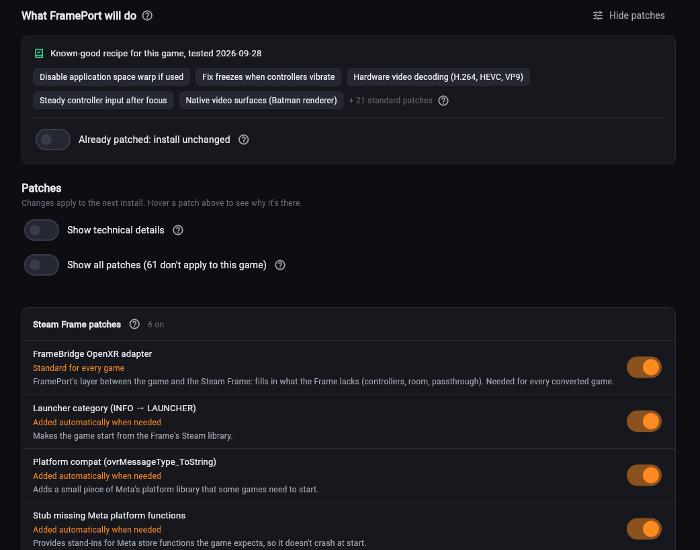
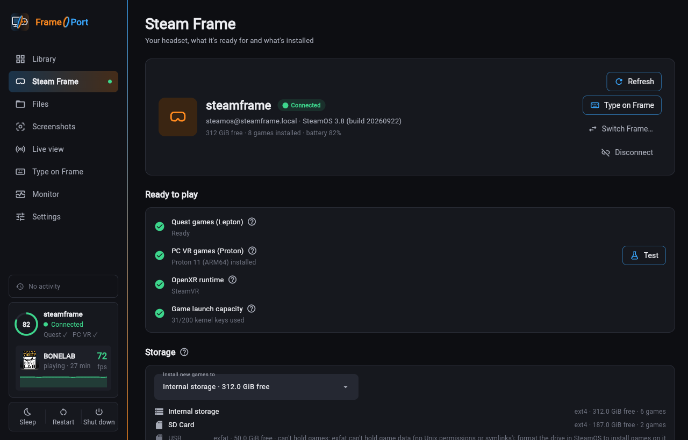

# Compatibility

FramePort's catalog has a tested recipe (the patches and settings that work) for many games, each marked as working,
working with issues or not running: see the [list of tested games](GAMES.md). Other games get suggested patches,
each with its reason. Every patch can be switched on or off under **Customize** on the game's page.

Got a game working? [Share its recipe](INSTALL.md#share-a-recipe-or-report-a-problem).

| Kind of game | On the Steam Frame |
|---|---|
| Quest games | Converted to OpenXR (the VR standard the Frame uses) by OVRPort and patched; they run in Lepton, Valve's Android runtime |
| Other Android VR apps using OpenXR (e.g. Pico builds) | Converted the same way; the other headset's own features and store services aren't available |
| Android apps without VR | Installed unchanged and shown as a window in the headset |
| PC VR games | On the Frame through Proton (experimental), or on your PC and streamed to the Frame: see [PC VR games](INSTALL.md#pc-vr-games) |
| Can't run | 32-bit-only or x86-only Android apps, apps for Pico's or HTC's own VR system, Android XR apps, and games that check their license through the Oculus app |

Automatic launch tests show that a game starts; only the headset shows whether it looks right.

