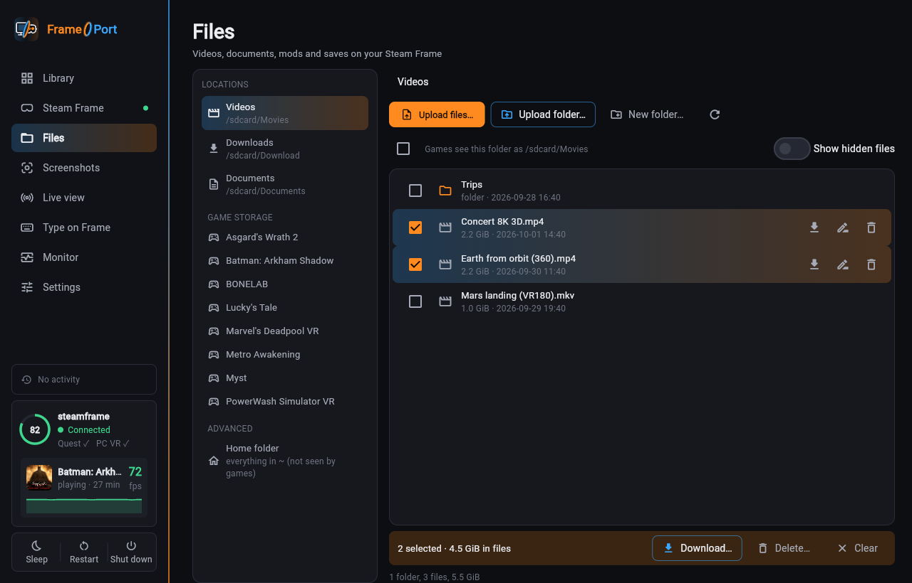

# Install and first steps

▶ **[Watch the install tutorial](media/frameport-install.mp4)** (about 90 seconds): from the download to the first
game on the Steam Frame.

[](media/frameport-install.mp4)

Download the file for your PC from the [latest release](https://github.com/spoopyghosty0/frameport/releases/latest)
and unpack it anywhere. No installer or admin rights are needed.

| Your PC | Download | Start |
|---|---|---|
| Windows 10/11 (x64) | `FramePort-windows-x64.zip` | `FramePort.exe` |
| macOS (Apple Silicon) | `FramePort-macos-arm64.zip` | `FramePort.app` |
| Linux (x64, Ubuntu 22.04 or newer) | `FramePort-linux-x64.tar.gz` | `FramePort/FramePort` |
| Linux (ARM64, Ubuntu 22.04 or newer) | `FramePort-linux-arm64.tar.gz` | `FramePort/FramePort` |

On first start FramePort downloads the tools it uses (Settings → Tools shows them).

## First launch

FramePort isn't signed with a paid certificate, so the first start shows a warning:

- **Windows:** "Windows protected your PC" → **More info** → **Run anyway**.
- **macOS:** right-click `FramePort.app` → **Open** → **Open** (once).
- **Linux:** `tar xzf FramePort-linux-x64.tar.gz && ./FramePort/FramePort`.

## Connecting the Steam Frame

The Frame and your PC must be on the same network (or connected with a [USB cable](#with-a-usb-cable)).

1. In FramePort open **Steam Frame** and click **Start setup**. Keep that page open.
2. On the Frame, first time only:
   1. Open the **SteamVR dashboard → Launch a program → Desktop**. The Frame's desktop opens.
   2. Open the app menu (bottom left) → **System → Konsole**, the Frame's terminal.
   3. Type this setup line and press **Enter** (on-screen keyboard or any USB or Bluetooth keyboard):

      ```
      curl -fsSL https://frameport.app/s | bash
      ```

      No keyboard? Open [the setup page](https://frameport.app/setup/) in Chromium on the Frame,
      tap **Copy** and paste it into Konsole.
   4. Konsole shows a 4-digit code. When FramePort shows the same code, click **Allow**. Nothing changes on the Frame
      before that.
   5. Steam restarts once and the desktop closes. If Steam asks to install **Lepton** (Valve's Android runtime),
      confirm it.

FramePort connects within a minute. No password is needed. The setup turns on **Developer Mode**;
[What the setup changes](FRAME_SETUP.md) lists everything.

Later, FramePort connects to the Frame by itself. If you turn Developer Mode off (Settings → System → **Enable
Developer Mode**), turn it on again there.

**Setup command:** if your network blocks FramePort's search, click **Use the setup command**. It shows a line with
your PC's address and a one-time code, for example `curl -fsS 192.168.1.20:8765/1a2b3c4d | bash`. Run it in Konsole instead.

**Without Konsole:** turn on Developer Mode yourself (Settings → System → **Enable Developer Mode**), then open
Settings → Developer → **Pair new host** on the Frame. FramePort finds the Frame and asks to connect; approve it in the
headset. Install Lepton from FramePort's Steam Frame page afterwards if it's missing.

### With a USB cable

A cable works on networks that block the setup, and uploads are faster (about 37 MB/s, three times typical Wi-Fi).

1. On the Frame, turn on Developer Mode (Settings → System → **Enable Developer Mode**). The cable only works in
   Developer Mode.
2. Connect the Frame's USB-C port to your PC. No driver is needed.
3. In FramePort click **Steam Frame → Set up with a USB cable** and follow the steps.

Uploads use the cable whenever it's plugged in. Unplug it any time: FramePort finds the Frame on Wi-Fi again.

### Firewalls

If the setup only says "timed out", a firewall on your PC blocks the Frame. After about 45 seconds the setup page
says which. Details: [Network and firewalls](FRAME_SETUP.md#network-and-firewalls).

## Running FramePort on the Frame (experimental)

FramePort can run on the Frame itself, without a PC:

1. Turn on Developer Mode (Settings → System → **Enable Developer Mode**).
2. In Desktop Mode, download `FramePort-linux-arm64.tar.gz`, unpack it (`tar xzf FramePort-linux-arm64.tar.gz`) and
   start `FramePort/FramePort`.

Games appear in the Steam library when you go back to Gaming Mode. Please report anything odd with **Report a
problem…**.

## Installing games


- **Install on Frame** on a game's page, or select several games in the Library and install them together. Installs
  run in the background; **Activity** shows the current one.
- **Update all** updates every game whose build changed, for example after a FramePort update.
- If the Frame sleeps or leaves the Wi-Fi, installs wait and continue when it's back. While installs run, the Frame
  stays awake.
- Your own game files are never changed. The patched copy is deleted once the game is on the Frame (Settings →
  Installing).
- In the downloaded app you can also **drag files onto the Library**: games, Linux apps, Windows programs or folders.

**Game settings…** (in the game's menu) shows the settings that matter for that game in plain words: sharpness,
refresh rate, controllers, menus, 360° video and mixed reality. Changes are used the next time the game starts.


### microSD cards and other drives

- The **Steam Frame** page's **Storage** section sets where new games go (**Install new games to**).
- To move an installed game, right-click it → **Move to…**. The game must be closed; saves and the Steam entry stay.
- A game on a card only starts while the card is inserted.
- Cards formatted as FAT, exFAT or NTFS can't hold games: format the card in SteamOS first.

### Android apps and Windows programs

- Android apps without VR are installed unchanged and shown as a window in the headset. If one shows nothing (or a
  VR app opens as a window), open **Customize** on the game's page, set **Show as VR or as a flat window** and click
  **Update on Frame**.
- **Add games → Add a Windows program…** adds a single Windows program. The Frame runs it as a window through Proton
  (Valve's tool for running Windows programs).

### Install links ("Install with FrameDrop" buttons)

Some websites have an **Install with FrameDrop** button. FramePort understands these buttons too:

- **Click a button** on Windows or Linux: FramePort opens, shows what it would download and asks first. Then it adds
  the game and installs it on the Frame.
- **Add games → Add from a link…** takes a button's address (right-click → Copy link) or a direct download link. Use
  it on macOS, where buttons can't open FramePort yet.
- **Settings → Install links** turns the buttons on or off. If FrameDrop is installed too, it keeps its buttons until
  you click **Use FramePort for these links**.
- Only `https://` links to public servers are used. Only install from sites you trust.

Website owners: see [Install button](INSTALL_BUTTON.md).

## Typing on the Frame

- **Type on Frame** (in the sidebar): while this tab is open, your PC's keyboard types on the Frame. Select a text
  field in the headset and type, or paste longer text into the box.
- **Steam's on-screen keyboard** works in apps shown as a window. Steam lists that window as **Gamescope**: leave it
  open.
- **Unity games whose text fields close at once:** FramePort suggests the patch **Make Unity text fields work**.
  Games added before this patch existed: open the game's menu → **Analyze again**, then reinstall.


## Watching the Frame

- **Monitor** (in the sidebar) shows the running game's frame rate, CPU, graphics, memory, temperature, power and
  battery, each with a 2-minute chart. **Show details** shows more.
- Under **Processes**, right-click a process to end it. **End game** closes the game like Steam's Exit game. A lock
  marks programs Steam or the desktop needs; FramePort asks again before ending those.
- **Live view** streams what the headset shows, with sound, to your browser. It uses about one CPU core of the Frame,
  so stop it when you're done.
- **Screenshots** shows the screenshots you took in the headset, sorted by game and day, to view or download.

## Updating

FramePort checks for a new version at start and every 6 hours. When there is one, the Library shows **Update now**:
FramePort downloads it, checks it, restarts and keeps your games and settings. **Later** skips that version.

- Settings → **Updates** turns the check off or turns on **Install updates automatically**.
- **Recipes** (the tested patches and settings for each game) update by themselves. A game whose recipe changed shows
  **Update on Frame**.
- **Dev builds:** if you're asked to test a change before its release, use Settings → Updates → **Install the latest
  dev build…**. The next release then arrives as a normal update.

## PC VR games

PC VR games are Windows VR games. Scan a folder of them (one folder per game) or use **Add games → Add a PC game
folder…**. FramePort asks which program starts the game if it finds more than one.

- **Play from this PC** (Windows with Steam and SteamVR): **Install on this PC** adds the game to Steam. Stream it to
  the Frame with Steam Link.
- **Play on the Frame (experimental):** on the Steam Frame page, install *PC VR games (Proton)*, then click **Install
  on Frame** on the game's page.
- **Oculus games** (made for Meta's Rift headset) need Revive, which FramePort downloads. Games that check their
  license through the Oculus app only run on your PC.

**Windows games without VR:** use **Add games → Add a PC game folder…** too. The Frame runs them as a window through
Proton, like Steam's own Windows games. Whether a game runs depends on Proton.

## Linux apps

**Add games → Add a Linux app…** takes an AppImage (a single-file Linux app) or a `.zip`/`.tar.gz`/`.tar.xz`
archive; **Add a Linux app folder…** takes an unpacked app. **Install on Frame** uploads it unchanged and adds it to
the Steam library.

- Apps built for **arm64** (the Frame's processor) run directly. Apps built for **x86_64** (most PCs) run through FEX,
  a translator Steam installs on the Frame the first time; they run slower. The game page shows which kind you have.
- If the app needs libraries the Frame doesn't have, the game page lists them: look for a build that includes them.
- Linux apps also appear in **Desktop Mode**'s app menu. Turn this off on the game
  page (**Desktop Mode**).

## Files on the Frame

The **Files** tab copies files between your PC and the Frame: videos, documents, mods and saves.



- Use **Upload files**, **Upload folder** and **New folder**; right-click an entry to download, rename or delete
  it. Drag across entries to select several.
- In the downloaded app you can drag files from your PC onto the list.
- **Videos**, **Downloads** and **Documents** are shared by every Quest game (inside the game: `/sdcard/Movies`,
  `/sdcard/Download`, `/sdcard/Documents`).
- **Game storage** holds each game's own files. A game's menu → **Add videos and files…** opens it.

## Share a recipe or report a problem

- **Share working recipe…** (in the game's menu) opens a GitHub issue with the game's recipe filled in. Accepted
  recipes become built-in for everyone. Untested games ask how they run after you install or test them.
- **Report a problem…** (in the game's menu, or Settings → Problems and feedback) saves a diagnostics zip with
  personal data removed and opens a GitHub issue to attach it to.

Without the app: [share a recipe](https://github.com/spoopyghosty0/frameport/issues/new?template=working-config.yml)
· [report a problem](https://github.com/spoopyghosty0/frameport/issues/new?template=bug-report.yml).

## Uninstalling

Settings → **Uninstall FramePort…** removes FramePort's data and, if you choose, its games on the Frame (saves can be
kept). It first saves your signing keys to Documents: you need them to update your games later. Then delete the
FramePort folder.

## Verify a download

`SHA256SUMS.txt` in each release lists the files' checksums: `sha256sum -c SHA256SUMS.txt`. Each file also has a
GitHub build attestation (proof that GitHub built it from this repository):
`gh attestation verify FramePort-windows-x64.zip -R spoopyghosty0/frameport`.

Windows: to show FramePort as the publisher, import `FramePort-selfsigned.cer` (attached to each release) into
*Trusted Root Certification Authorities* (Current User). The certificate can only sign code; remove it with
`certmgr.msc`. Its SHA-256 fingerprint:
`4E:12:98:91:62:C0:E4:50:FB:65:1D:34:BB:73:00:09:7B:78:BE:88:5C:A7:6C:42:23:46:9B:92:A1:59:A7:6E`.

## For power users: the command line

The **command-line version** (Python 3.11 or newer) installs from the release's
`frameport-<version>-py3-none-any.whl` with `uv tool install <link>` (or pipx or pip).

Everything the app does is also a `frameport` command; `frameport --help` and `frameport <command> --help` list every
option. The main ones:

| Command | What it does |
|---|---|
| `scan <folder>` / `list` / `show <game>` | add games, list the library, show a game's patches |
| `add-linux <path> [--exe <program>]` | add a Linux app (AppImage, folder or archive) |
| `recipe <game> --enable/--disable <patch>` | change a game's patches (`patches` lists them all) |
| `build <game>` / `install <game>` / `test <game>` | build, install on the Frame (`--to pc` for this PC), launch test |
| `frame discover` / `frame connect` / `frame info` | find, connect to and describe the Frame |
| `frame send <files> --dest videos` / `frame storage` / `frame cleanup` | copy files to the Frame, list where they can go, free space |
| `frame drives` / `frame move <game> --to <drive>` / `install --dest <drive>` | list the Frame's drives, move a game, install to a drive |
| `tools status` / `tools install` | the tools FramePort downloads |
| `open-link "<link>"` | install from an install button's address or a download link (`--yes`, `--no-install`) |
| `diag report <game>` / `share-recipe <game>` | report a problem / share a working recipe |
| `update` | update FramePort (`--check` only checks: exit code 10 = update available) |
| `uninstall-app` | uninstall FramePort |

Exit codes: 0 done, 1 failed, 2 wrong usage. `FRAMEPORT_DEBUG=1` shows full error details;
`FRAMEPORT_NO_UPDATE_CHECK=1` turns update checks off.
