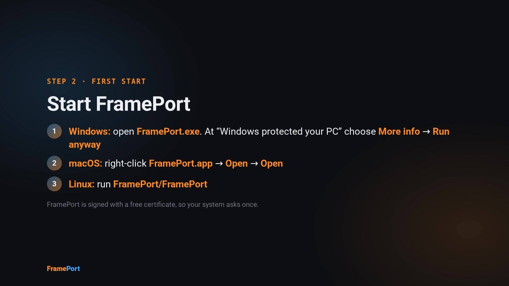
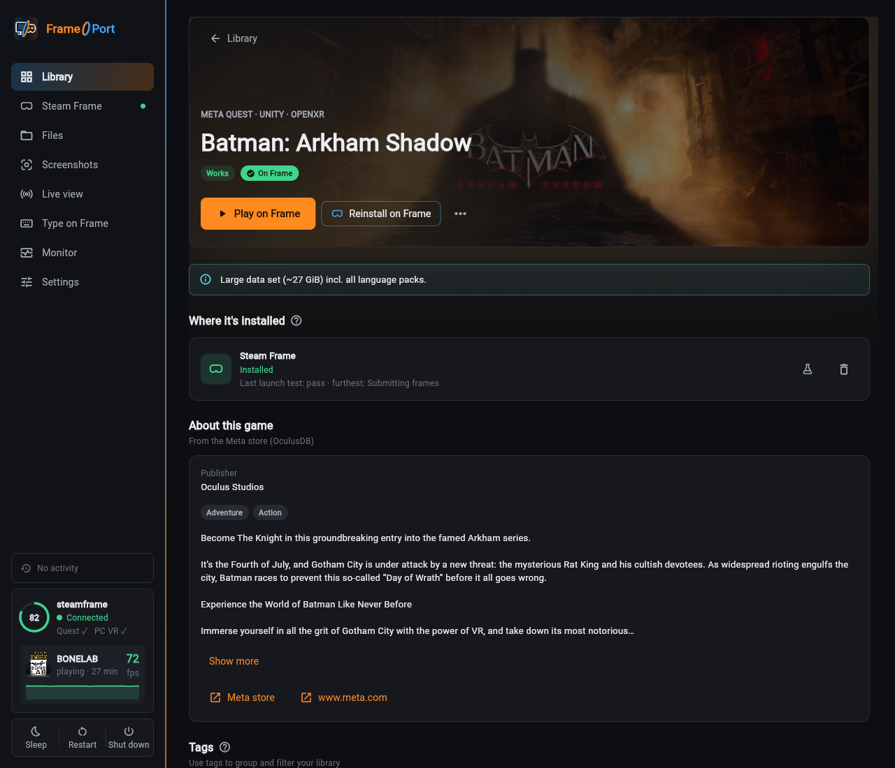
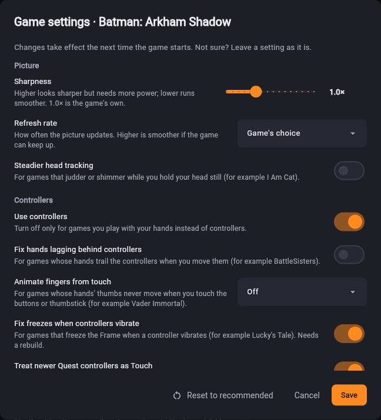

# Installing FramePort

▶ **[Watch the install tutorial](media/frameport-install.mp4)** (about 90 seconds, MP4; also attached to every
release as `FramePort-install.mp4`): from the download to the first game on the Frame.

Download the archive for your computer from the [latest release](https://github.com/spoopyghosty0/frameport/releases/latest)
and extract it anywhere. No installer or admin rights are needed. On first start FramePort downloads its Java
runtime, the OVRPort CLI and apksigner into its data folder (Settings → Tools shows them).

| Computer | Archive | Start |
|---|---|---|
| Windows 10/11 (x64) | `FramePort-windows-x64.zip` | `FramePort.exe` |
| macOS (Apple Silicon) | `FramePort-macos-arm64.zip` | `FramePort.app` |
| Linux (x64, GTK 3; Ubuntu 22.04 or newer) | `FramePort-linux-x64.tar.gz` | `FramePort/FramePort` |
| Linux (ARM64, GTK 3; Ubuntu 22.04 or newer) | `FramePort-linux-arm64.tar.gz` | `FramePort/FramePort` |
| Command line only (Python 3.11+) | `frameport-<version>-py3-none-any.whl` | `frameport --help` |

The command-line version installs from the wheel's release link with `uv tool install <link>` (or pipx / pip).

## First launch

The builds are signed with a free self-signed certificate (Windows) and an ad-hoc signature (macOS), so the first
start shows a warning:

- **Windows:** "Windows protected your PC" → **More info** → **Run anyway**. Optional: import
  `FramePort-selfsigned.cer` (attached to each release) into *Trusted Root Certification Authorities* (Current User) to
  show FramePort as the publisher; the certificate can only sign code. Remove it with `certmgr.msc`.
- **macOS:** right-click `FramePort.app` → **Open** → **Open** (once), or `xattr -dr com.apple.quarantine FramePort.app`.
- **Linux:** `tar xzf FramePort-linux-x64.tar.gz && ./FramePort/FramePort` (ARM64: `FramePort-linux-arm64.tar.gz`).

## Connecting the Steam Frame

The Frame and the computer must be on the same network.

1. In FramePort open **Steam Frame** and click **Show setup command**.
2. First time only, on the Frame:
   1. Open the **SteamVR dashboard → Launch a program → Desktop**: the Linux desktop opens on a virtual screen.
   2. Open the app menu (bottom-left corner of that desktop) → **System → Konsole** (or search for Konsole).
   3. Type the command FramePort shows exactly as shown (on-screen keyboard or any USB/Bluetooth keyboard) and press
      **Enter**. It looks like `curl -fsS 192.168.1.20:8765/1a2b3c4d | bash`: your computer's address, then a
      one-time code.
   4. After a few seconds the desktop closes by itself (Steam restarts once); that's expected. If
      Steam asks to install **Lepton** (Valve's Android runtime), confirm it.

   FramePort connects by itself within a minute. No password is needed. The command lets FramePort in and turns on
   **Developer Mode** (which includes SSH); everything it changes is listed in [FRAME_SETUP.md](FRAME_SETUP.md).
3. Later starts: a Frame in Developer Mode appears in the list and FramePort connects to it automatically. (If you
   turn Developer Mode off in Settings → System → Developer, turn it on again there.)

**Without Konsole:** turn on Developer Mode yourself (Settings → System → Developer). The Frame then appears under
**On your network**. On the Frame open Settings → Developer → **Pair new host**, then click **Connect** in FramePort
and approve it on the Frame (Valve's own devkit pairing; it only sends this computer's key to the Frame). Install
Lepton from the Steam Frame page afterwards if it's missing.

### With a USB cable

For networks that block the setup (guest Wi-Fi, firewalls, discovery not working), and for faster uploads:

1. On the Frame, turn on **Developer Mode** (Settings → System → Developer Mode). The Frame's USB network only exists
   in Developer Mode.
2. Connect the Frame's USB-C port to the computer.
3. In FramePort: **Steam Frame → Set up with a USB cable**. FramePort detects the cable and shows the setup command,
   which reaches the computer over the cable. Already set up? It connects over the cable right away.

The cable needs no driver on Windows 10/11, macOS or Linux, and the computer gets an address from the Frame
automatically. Uploads use the cable whenever it's plugged in (about 37 MB/s, ~3× typical Wi-Fi), even when FramePort
connected over Wi-Fi. Unplug it any time: FramePort finds the Frame on Wi-Fi again by itself.

### Firewalls

If the setup command only says "timed out", a firewall on your computer blocks the Frame; the setup page
says which after about 45 seconds. Details per system: [FRAME_SETUP.md](FRAME_SETUP.md#network-and-firewalls).

## Running FramePort on the Frame (experimental)

FramePort can run on the Steam Frame itself, without a PC: in **Desktop Mode**, download
`FramePort-linux-arm64.tar.gz`, unpack it (`tar xzf FramePort-linux-arm64.tar.gz`) and start `FramePort/FramePort`.
Turn on **Developer Mode** first (Steam → Settings → System); FramePort then manages "This Frame" directly, with
no pairing. Games are added to the Steam library when you go back to **Gaming Mode** (Steam has to restart for it,
which would end Desktop Mode). This is new: please report anything odd with **Report a problem**.

## Installing games

- **Install on Frame** on a game's page (or select several in the Library and install them together). Installs run
  one after another in the background; **Activity** shows the current one at the top.
- **Update all** reinstalls every game whose build changed (e.g. after a FramePort update). Questions that need an
  answer (e.g. Oculus games that can't run on the Frame) are asked once, for all games.
- If the Frame goes to sleep, turns off or leaves the Wi-Fi, the queue **waits** and continues once it's back; uploads
  pick up where they stopped. While installs run, FramePort keeps the Frame from going to sleep. Before a large batch
  it checks the Frame has enough free space.
- **microSD card / other drives:** the **Steam Frame** page's **Storage** section lists the Frame's drives and sets
  where new games go (**Install new games to**). Games go into a `FramePort` folder on the card. To move a game that's
  installed already, right-click it → **Move to…** (the game must be closed; saves, settings and the Steam entry stay).
  A game on the card only starts while the card is inserted (FramePort then says "SD Card not inserted"). Cards
  formatted as FAT, exFAT or NTFS can't hold games: format the card in SteamOS first.
- Your own game files are never changed. The converted copy is temporary: it's removed once the game is on the Frame
  (Settings → Installing: keep them, or remove all now).
- **Game settings…** (game menu or the Steam Frame page): sharpness, refresh rate, controllers, menus, 360° video and
  mixed-reality options in plain words, only those that matter for the game. Changes are kept with the game and,
  when it's installed, used the next time it starts.
- Ordinary Android apps (no VR) are installed unchanged and shown as a flat window in the headset. Android's
  back/home/recents buttons are hidden by default (patch **Hide Android's navigation bar**). If FramePort guesses
  wrong (a phone app shows nothing in the headset, or a VR app opens as a flat window), choose **VR** or **Flat
  window** under **Show as VR or as a flat window** in the game's **Customize** section, then **Update on Frame**.
- **Add games → Add a Windows program…** adds a single Windows program; the Frame runs it through Proton (as a
  window unless it is a VR game). A program sitting in Downloads, the home folder or a drive root is copied on its
  own first, so the install doesn't upload everything next to it.
- In the packaged app you can also **drag files onto the Library**: APKs, Linux apps (AppImage, `.zip`/`.tar.gz`),
  Windows programs (`.exe`), folders, or a FrameDrop manifest (`.json`).

### Install links ("Install with FrameDrop" buttons)

Some developers put an **Install with FrameDrop** button on their site (the one-click protocol of the FrameDrop
sideloader, documented at framedropvr.com/docs). FramePort understands the same links:

- **Clicking a button** opens FramePort (or the window that's already open) on Windows and Linux. FramePort shows
  the title, the files, their size and whether a checksum is given, and asks before it downloads anything. Then it
  downloads the build, adds it to your library and starts the usual install on the Frame. If no Frame is connected,
  the game is added now and installs once the Frame is back.
- **Add games → Add from a link…** takes the button's address (right-click → Copy link), a `framedrop://` or
  `frameport://` link, a manifest (`.json`) or a direct link to an APK, a Linux build or a Windows program. Use it on
  macOS, where web pages can't hand links to FramePort yet.
- **Settings → Install links** has one switch for `framedrop://` links (the buttons) and one for FramePort's own
  `frameport://` links. Both are on by default. If FrameDrop is installed too and already opens `framedrop://`
  links, FramePort leaves them to it; **Use FramePort for these links** takes them over (turn the switch off to give
  them back).
- **For developers:** a FrameDrop manifest works as it is
  (`{"schema": "framedrop.install/v1", "name": "…", "files": [{"url": "https://…", "sha256": "…"}]}`). FramePort
  also reads an optional `"frameport": {"description": "…", "icon": "https://….png"}` object (FrameDrop ignores
  it): the install question then shows the icon and description, and they become the game's icon and "About this
  game" text when no store has them. For your page there's an "Install with FramePort" button:
  [INSTALL_BUTTON.md](INSTALL_BUTTON.md). Without a manifest (a bare file link) FramePort guesses the title from the
  file name and replaces it with the app's own name once it's downloaded.
- Only `https://` links to public servers are used (plain `http://` only on this PC, for testing); links with a
  user name or password, or pointing into your local network, are refused. Only install from sites you trust.

Each game has **Game settings** in plain words (sharpness, refresh rate, controllers, menus, 360° video, mixed
reality), showing only what matters for that game. Changes are kept with the game and reach the Frame right away.

## Typing on the Frame

- **Type on Frame** (its own tab in the sidebar; also on the Steam Frame page): while the tab is
  open, this computer's keyboard works as a keyboard plugged into the Frame. Select a text field in the headset (in
  an app, Steam or the desktop) and type; Esc and shortcuts go to the Frame too. Paste longer text into the box to
  type it in one go (US keyboard layout). Opening another tab disconnects the keyboard.
- **Steam's on-screen keyboard** opens for text fields of apps shown as a window (2D apps, and VR apps with
  **Show the app's Android window**). Steam lists that window as **Gamescope** (the Frame's display compositor);
  leave it open: it's what receives the typing, the VR view isn't affected.
- **Unity apps whose text fields close at once** (a caret flashes, nothing can be typed): FramePort suggests
  **Make Unity text fields work** for them. The first time, it downloads Cpp2IL (a tool that finds the right spot in the
  game's code, ~17 MB). Games added before this version: open the game's menu → **Analyze again**, then reinstall.

## Watching the Frame (Monitor)

- **Monitor** (its own tab in the sidebar) shows live what the Frame is doing while the tab is open: the running game
  with its frame rate (Quest games), CPU, graphics chip, memory, the hottest temperature with the fan speed, power
  draw and battery time left, each with a 2-minute chart. **Show details** adds every CPU core, all temperature
  sensors, where the power goes and the network.
- **Processes**: **Game** (default) lists the running game's processes, **Steam & SteamVR** and **All** show more.
  Right-click a process (or use **⋯**) to end it, force-kill it or end its whole game; **End game** on the game card
  closes the game the way Steam's Exit game does. A lock marks programs whose end would close Steam, SteamVR or the
  desktop: FramePort asks again before ending those.
- The numbers come every second (or every 2/5 s) and cost the Frame about 1 % of one CPU core; nothing keeps
  running on the Frame after you leave the tab.

## Updating

**Game configs** (the tested recipes in the catalog) update by themselves: FramePort checks GitHub every 6 hours for
newly confirmed or fixed configs and uses them without a FramePort update; a game whose recipe changed then shows
**Update on Frame**. Configs that need a newer FramePort are skipped until you update. Settings → Data shows the last
check (**Check now**) and turns this off.

FramePort checks for a new release at start and every 6 hours (it only downloads the release information). When one
exists, the Library shows **Update now**: FramePort downloads the new version, verifies it against the release's
`SHA256SUMS.txt` (on Windows also the signature), restarts and opens as the new version. Games, settings, signing keys
and the Frame connection are kept. Running installs finish first. **Later** skips that version.

Settings → **Updates**: turn the check off, or turn on **Install updates automatically** (downloads in the background,
installs at the next start). If FramePort's folder isn't writable, **Update now** opens the release page instead. The
update log is `logs/update.log` in the data folder.

**Dev builds:** when you're asked to test a fix before it's released, use Settings → Updates → **Install the latest
dev build…**. It shows what to test, then installs like an update (same checks). Dev builds are less tested; the next
release is offered to you as a normal update.

Command line: `frameport update` (`--check` only checks, exit code 10 = update available; `--yes` doesn't ask).
`FRAMEPORT_NO_UPDATE_CHECK=1` turns all checks off.

## PC VR games

PC VR games are Windows VR games (OpenXR, SteamVR or Oculus). Scan a folder of them (one folder per game) or use
**Add games → Add a PC game folder…**. FramePort finds the game's program and asks when there is more than one
candidate. **Already patched** on a game page installs a copy unchanged. Oculus-only games need Revive: FramePort uses
an installed Revive, or downloads a portable copy.

- **Play from this PC:** Windows with Steam and SteamVR. **Install on this PC** adds the game to Steam; stream it to the
  Frame with Steam Link. If a game can't keep up with the refresh rate, FramePort lowers the rate and enables motion
  smoothing in SteamVR's per-game settings the next time you press Play.
- **Play on the Frame (experimental):** Steam Frame → *PC VR games (Proton)* → **Install**, then **Install on Frame**
  on the game page.
- Games that use the Oculus Platform SDK check the licence through the Oculus app, so they run on the PC only.

**Windows games without VR:** **Add games → Add a PC game folder…** with the game's folder (pick the program that
starts it if asked). FramePort installs it on the Frame and Proton runs it as a window, like Steam's own Windows games;
it shows up in the Frame's Steam library tagged "Windows game on Frame". Whether a game runs depends on Proton on ARM
(x86 games run through emulation).

## Linux apps

The Frame runs SteamOS on an arm64 CPU, so native Linux apps built for **aarch64/arm64** run on it directly (no
Android container, no Proton). **Add games → Add a Linux app…** takes an AppImage or a `.zip`/`.tar.gz`/
`.tar.xz` archive; **Add a Linux app folder…** takes an unpacked app. FramePort finds the program that starts it (the
game page's **Change…** picks another one) and whether it's a VR (OpenXR) app. **Install on Frame** uploads it
unchanged and adds it to the Frame's Steam library, tagged "Linux app on Frame"; Play, launch tests and Uninstall
work like for other games.

- **x86_64 builds** run through **FEX**, Valve's x86 translator, with the x86 system libraries SteamOS ships for it
  (the way Steam on the Frame runs x86 Linux games). The first install of one installs FEX on the Frame (Steam
  restarts once and downloads it, a few MB). They run slower than arm64 builds: when an app offers both, FramePort picks the arm64 one. The game
  page shows which CPU a build is for.
- The app must bring the libraries SteamOS doesn't have (checked for arm64 builds; x86_64 builds use FEX's x86
  system, which has glibc and Mesa, and aren't checked ahead). If some are missing, the install reports them and the game
  page lists them: look for a build that includes them.
- **Desktop Mode:** Linux apps also appear in Desktop Mode's application menu and as an icon on its desktop. Some
  apps work better there, with a mouse and keyboard, than in Gaming Mode (where Steam Input turns the controllers into
  a gamepad). Switch it off per app on the game page (**Desktop Mode**).
- From the command line: `frameport add-linux <AppImage, folder or archive> [--exe <program>]`.

## Files on the Frame (videos, documents, mods, saves)

The **Files** tab manages files on the Frame over the same connection as installs; no other transfer app is needed.
Pick a location, browse folders, and use **Upload files** / **Upload folder**, **New folder**, or the download, rename
and delete buttons on each entry. Right-click an entry (or the empty space) for the same actions in a menu. Tick
several entries (or the box above the list for all), or click and drag across them, to download or delete them
together; a right-click on one of them then acts on all. The **Screenshots** tab and the **Library** work the same
way: right-click for a menu, drag across cards to select several. In the downloaded app you can also drag files and folders from Explorer / Finder / your file manager onto
the list to upload them into the open folder. Uploads and downloads run in the Activity panel, resume after an interruption and
skip files that are already there.

- **Videos**, **Downloads** and **Documents** appear inside every Quest game as `/sdcard/Movies`, `/sdcard/Download`
  and `/sdcard/Documents`. Apps find files by browsing folders; Android's media index doesn't work on the Frame.
- Under **Game storage**, each installed game has its own `/sdcard` (mods, saves). A game's menu → **Add videos and
  files…** opens it. Video players that list only their own folder (e.g. 4XVR's "Internal Storage" = `4XPlayer`) find
  videos uploaded into that folder.
- **Home folder** shows everything in the Frame's home folder (hidden files with **Show hidden files**).

Command line: `frameport frame send <files> --dest videos` (`frameport frame storage` lists the destinations).

## Sharing a working game, reporting a problem

- **Share working recipe…** (game menu): opens a prefilled GitHub issue with the game's patches and settings. Accepted
  configs become built-in recipes. Untested games ask on their page once they've been installed or tested: **It
  works**, **It has issues** or **It doesn't run**.
- **Report a problem…** (game menu, or Settings → Problems and feedback): saves a diagnostics zip to Documents (logs,
  recipe, device details; IP addresses, user names, home folders and Steam ids replaced) and opens a prefilled GitHub
  issue to attach it to. Command line: `frameport diag report <game>`, `frameport share-recipe <game>`.

## Command line

Everything the app does is also a `frameport` command (in a source checkout: `uv run frameport`); `frameport --help`
and `frameport <command> --help` describe every option. The main ones:

| Command | What it does |
|---|---|
| `scan <folder>` / `list` / `show <game>` | add games, list the library, show a game's analysis and patches |
| `add-linux <path>` | add a Linux app, arm64 or x86_64 (AppImage, folder or archive) |
| `recipe <game> --enable/--disable <patch>` | change a game's patches (`patches` lists them all) |
| `build <game>` / `install <game>` / `test <game>` | build, install on the Frame (`--to pc` for PC VR on this PC), launch test |
| `frame discover` / `frame connect` / `frame info` | find, pair with and describe the Frame |
| `frame send` / `frame storage` / `frame cleanup` | copy files to the Frame, show where they go, free space |
| `frame drives` / `frame move <game> --to <drive>` / `install --dest <drive>` | the Frame's drives (microSD), move a game, install to a drive |
| `tools status` / `tools install` | the tools FramePort downloads |
| `open-link "<link>"` | install from an "Install with FrameDrop" button's address or a manifest/APK/zip link (`--yes`, `--no-install`) |
| `diag report <game>` / `share-recipe <game>` | report a problem / share a working recipe |
| `update` | update FramePort |

Exit codes: 0 done, 1 something failed, 2 wrong usage, 10 (`update --check`) a newer version exists. Errors are
one line on stderr; `FRAMEPORT_DEBUG=1` shows the full traceback.

## Uninstalling

Settings → **Uninstall FramePort…** (or `frameport uninstall-app`) removes its data folder, the Steam shortcuts it
added on this computer and, optionally, its games on the Frame (saves can be kept). It first saves your signing keys
to Documents: game updates must be signed with the same key. Then delete the program folder.

## Verify a download

Each archive has a GitHub build attestation:
`gh attestation verify FramePort-windows-x64.zip -R spoopyghosty0/frameport`. `SHA256SUMS.txt` lists the checksums
(`sha256sum -c SHA256SUMS.txt`). Windows certificate SHA-256 fingerprint:
`4E:12:98:91:62:C0:E4:50:FB:65:1D:34:BB:73:00:09:7B:78:BE:88:5C:A7:6C:42:23:46:9B:92:A1:59:A7:6E`.
