# Install button

A button for web pages and READMEs that opens a game straight in FramePort. Clicking it hands FramePort an install
link; FramePort shows what it would download and asks before it does anything (see
[Install links](INSTALL.md#install-links-install-with-frameport-buttons)).

<p>
  
</p>

## Files

All files are in [`docs/badges/`](badges/). Each SVG is self-contained (no external fonts or images), 216 × 60.

| File | Use it for |
|---|---|
| [`install-with-frameport.svg`](badges/install-with-frameport.svg) | Everywhere. No motion. |
| [`install-with-frameport-animated.svg`](badges/install-with-frameport-animated.svg) | GitHub READMEs and other pages that only allow images. The glow plays by itself every 6 seconds. |
| [`install-with-frameport-hover.svg`](badges/install-with-frameport-hover.svg) | Websites where you can paste HTML. It glows while the pointer is on it, but only when its SVG code is in the page itself (see below). |
| [`install-with-frameport@2x.png`](badges/install-with-frameport@2x.png) | Places without SVG support (some forums, email). 432 × 120; show it at 216 × 60. |

Both animated versions stop moving for visitors who turn on reduced motion in their system settings.

## The link

The button links to FramePort's install page, which names either a manifest or one file:

```
https://frameport.app/install?manifest=<URL-encoded https address of a manifest .json>
https://frameport.app/install?url=<URL-encoded https address of an .apk, a Linux build (.zip, .tar.*, .AppImage) or a Windows .exe>
```

The page shows what the link installs, opens FramePort with the matching `frameport://` link and, when FramePort
isn't installed, offers the download. Pages that only target people who already have FramePort can link to the
`frameport://` form directly:

```
frameport://install?manifest=<URL-encoded https address of a manifest .json>
frameport://install?url=<URL-encoded https address of an .apk, a Linux build (.zip, .tar.*, .AppImage) or a Windows .exe>
```

The manifest:

```json
{
  "schema": "framedrop.install/v1",
  "name": "My Game",
  "files": [{ "url": "https://example.com/my-game.apk", "sha256": "<64 hex digits>" }],
  "frameport": { "description": "One sentence about the game.", "icon": "https://example.com/icon.png" }
}
```

`name` becomes the game's title in Steam. `sha256` is optional but recommended: FramePort checks the download
against it. The `frameport` object is optional; its icon and description are shown in the
install question. Only public `https://` addresses are accepted.

To build a link from Python: `frameport.deeplink.make_link(manifest_url="https://…/my-game.json")`.

## On a website

Image version (any page):

```html
<a href="frameport://install?manifest=https%3A%2F%2Fexample.com%2Fmy-game.json">
  
</a>
```

Hover version: paste the contents of `install-with-frameport-hover.svg` inside the link instead of the ``, and
give the link an accessible name:

```html
<a href="frameport://install?manifest=https%3A%2F%2Fexample.com%2Fmy-game.json" aria-label="Install with FramePort">
  <svg …>…</svg>  <!-- the whole file -->
</a>
```

Host the files yourself, or load them from jsDelivr, which serves them with the right content type:
`https://cdn.jsdelivr.net/gh/spoopyghosty0/frameport@main/docs/badges/install-with-frameport.svg` (replace `main`
with a release tag such as `v1.0.0` to pin a version; jsDelivr caches `@main` for up to 12 hours).

## In a GitHub README

GitHub removes links that don't start with `https://` or `http://` from READMEs, so a `frameport://` link there is
not clickable. Use the `https://frameport.app/install?…` link:

```markdown
[](https://frameport.app/install?manifest=https%3A%2F%2Fexample.com%2Fmy-game.json)
```

Use the animated or still SVG: GitHub shows SVGs as images, so the hover version doesn't react there.

## Testing your setup

The example button on [frameport.app](https://frameport.app/#button) uses a demo link:

```
https://frameport.app/install/?manifest=https%3A%2F%2Fframeport.app%2Fdemo%2Fcool-game.json
```

Click it to check that FramePort receives install links on your PC. FramePort recognises this one address and shows
a demo install question for a placeholder game, "Cool Game"; nothing is downloaded, added to the library or
installed (`frameport open-link` says it's the demo link and stops). Real buttons install real games.

## If a visitor doesn't have FramePort

The `https://frameport.app/install?…` link handles this: its page offers the download and a second try. A bare
`frameport://` link does nothing visible (or shows the browser's "no app for this link" message) when FramePort
isn't installed; put a line next to such a button, for example "Needs [FramePort](https://frameport.app)". On macOS, web pages can't hand links to FramePort yet: users paste the link into Add games →
Add from a link….

## Usage rules

- Keep the alt text "Install with FramePort".
- Don't recolor, stretch, crop or redraw the button, and don't show it smaller than 40 px tall.
- Leave some space around it (at least 8 px) so it doesn't touch other buttons.
- It works on light and dark pages as it is; there is no light version.
