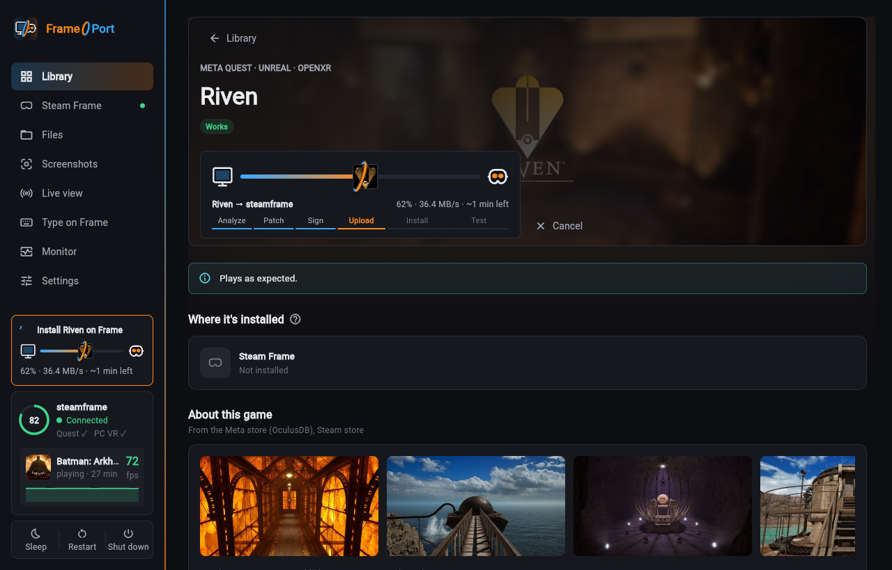
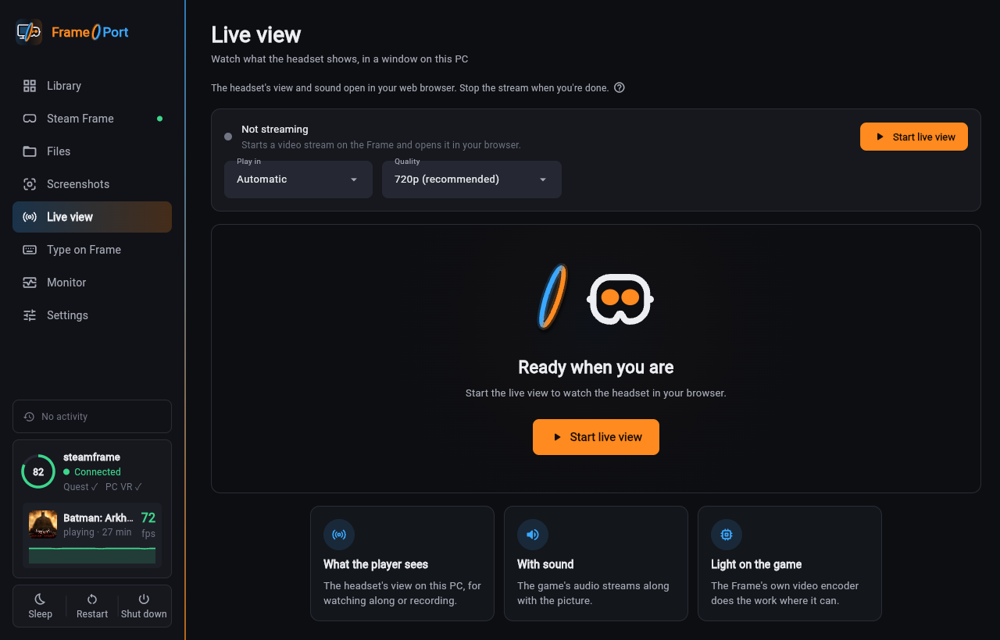
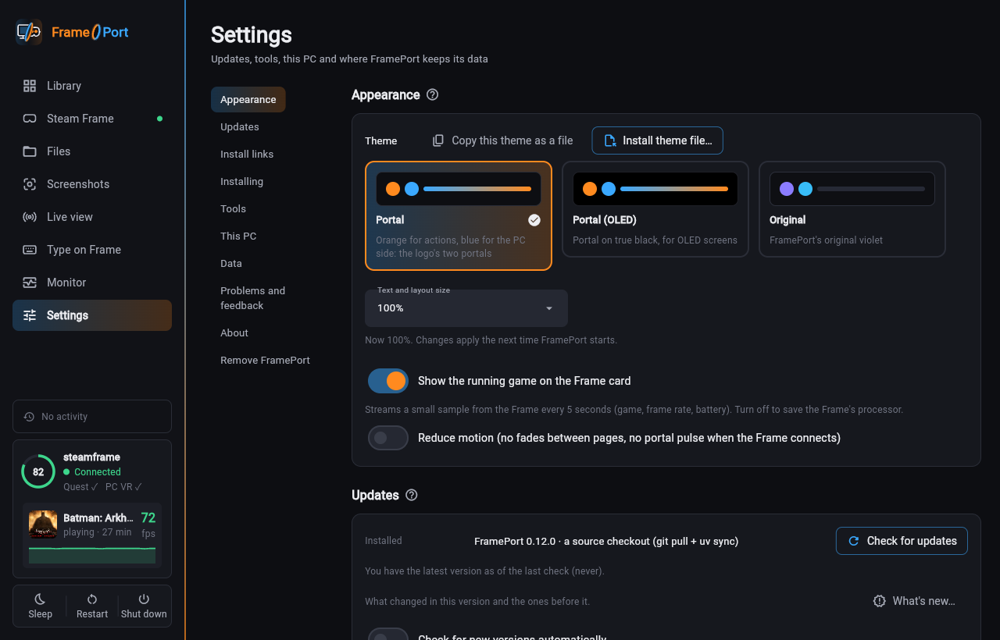

# Screenshots and the demo video

The pictures in the docs and the demo tour are rendered by scripts, never taken by hand. Two scripts show the real
FramePort GUI with a demo library and a pretend Steam Frame, drive it the way a person would, and film or photograph
it:

| What | Source | Output |
|---|---|---|
| Docs screenshots | `docs/showcase/shots.yaml` | `docs/images/*.png` |
| Demo tour (about 90 s) | `docs/showcase/tour.yaml` | `docs/media/frameport-tour.mp4` (+ `.jpg` poster), `docs/images/tour-teaser.webp` (README) |

Nothing comes from anyone's own library. The demo library (`docs/showcase/demo-library.yaml`) lists real catalog
games, so recipes and patches are the ones FramePort really uses. Their technical analysis (`demo-analyses.json`:
engine, VR API, libraries, sizes) was exported from real APK analyses without any paths. Art and store details come
from the same public sources the app uses and are cached in `~/.cache/frameport-showcase`. The renderer refuses to
run in FramePort's own data folder, scans the demo data for home paths and IP addresses first, and stops when a
store didn't send art (placeholders never reach the docs; `--allow-missing-art` overrides that).

## Running it

You need the dev extras, Chromium for Playwright and ffmpeg:

```
UV_LINK_MODE=copy uv sync --extra dev
uv run playwright install chromium        # once
uv run python scripts/showcase/render_docs.py               # all screenshots → docs/images (changed ones only)
uv run python scripts/showcase/render_docs.py --only game,monitor --out /tmp/shots
uv run python scripts/showcase/record_tour.py --draft       # quick 720p check of a storyboard edit
uv run python scripts/showcase/record_tour.py               # the real thing → docs/media + the teaser
```

A screenshot is rewritten only when it visibly changed (`render_docs.changed`: anti-aliasing noise doesn't count),
so running it twice changes nothing. `--check` writes nothing and exits 1 when a docs image is out of date.
`record_tour.py --names` prints what can be clicked after each scene, which helps when writing steps. The video is
encoded at the best quality that fits 12 MB, the teaser at 4 MB.

## Writing steps

Shots and scenes use one step language (`scripts/showcase/steps.py`). A step is a one-key mapping:

```yaml
- go: monitor                                  # a sidebar route
- open_game: ${game}                           # or {package: …, advanced: true}
- call: {fn: settings_dialog, args: ["${game}"]}   # any app method
- hover: "Batman: Arkham Shadow"               # the pointer: by name…
- hover: {name: "Batman: Arkham Shadow", dy: 0.3}  # …offset inside the element (fraction of its size, or px)
- click: "Install on Frame"                    # right_click, double_click, drag: [from, …, to]
- type: "ri"                                   # press: Escape
- wait_for: "Batman: Arkham Shadow · 2026-10-04 21:50"
- wait: 1.2
- hook: {name: held_install, args: ["${new_game}"]}   # the pretend Frame's scripted events
```

Elements are found by name through Flutter's accessibility tree: their visible text, a tooltip or a semantics
label. Exact names win over prefixes, and buttons and cards win over plain text. When several match, the innermost
one wins (a list carries the text of its rows; the row is meant). Icon-only buttons need a tooltip to be found,
which also helps screen readers. The pointer moves on eased, slightly curved paths and is drawn into the picture,
with a ring on every click.

Hooks (`steps.HOOKS`) cover what a real Frame would do:
- `fake_install`: an install through the real job queue with every real stage name and a launch test that passes.
- `held_install`: an install that stops mid-upload, for screenshots of the progress.
- `connect` and `disconnect`
- `live_stream`: a test picture through the real relay.
- `monitor_details`, `type_tab`, `select_files` and `settings_section`.

In the tour, clicking Install runs the scripted install, and the game is then installed on the pretend Frame.

Pictures must not change from one run to the next:
- Screenshot and file dates are fixed.
- The Monitor's stream stops after its two-minute history.
- The pointer leaves the page before a still picture is taken.
- Each shot gets a fresh window and browser.
- A picture is taken once the page has stopped changing.

Live data, such as the live view's relay port and data rate, doesn't belong in a docs screenshot.

## How it runs on GitHub

The `showcase` workflow (`.github/workflows/showcase.yml`):
1. **When it runs:** on pushes to `main` that touch the UI, its translations or the showcase files, and on
   **Run workflow**.
2. **What it renders:** the screenshots every time. The tour only when `tour.yaml` or the scripts changed, or when
   it's ticked on a manual run (so UI tweaks don't re-commit a 10 MB video).
3. **What happens next:** every render is uploaded as the run's `showcase` artifact. When a picture changed, the
   workflow opens or updates the pull request on branch `showcase/update`, which you review and merge.

Releases attach the committed tour as `FramePort-tour.mp4`.

## Gallery

These are renders the README doesn't show (yet):

| | |
|---|---|
|  |  |
|  |  |
